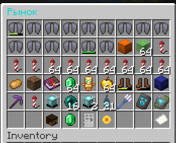

# Auction plugin for EmpireProjekt.ru

## No-Lag, Free, Live Database reload during server runtime without lags!

<p align="center">
  
</p>


Advantages:

- [x] Sorting: Name, Date, Type, Player
- [x] Grouping by players
- [x] Min and Max prices
- [x] Max amount per player
- [x] Broadcast when auction created
- [x] Sounds on click, open, sold etc.
- [x] Permissions
- [x] Customizable buttons
- [x] Fully translatable
- [x] Runtime config and database reload
- [x] Custom currency support

| Command                           | Description                                     | Permission              |
|:----------------------------------|:------------------------------------------------|:------------------------|
| ️`/amarket`                       | Open market                                     | astra_market.command    |
| ️`/amarket open [PLAYER]`         | Open market [of player]                         | astra_market.command    |
| ️`/amarket expired [PLAYER]`      | Open expired menu [of player]                   | astra_market.command    |
| ️`/amarket players`               | Open player list who have active slots          | astra_market.command    |
| ️`/amarket sell <price> <amount>` | Sell items on market                            | astra_market.sell       |
| ️-                                | Allows player to sell up to N items at one time | astra_market.sell_max.N |
| ️`/amarketreload`                 | reload plugin                                   | astra_market.reload     |

### Configuring configs

At first launch there will be created config.yml

If plugin can't read config there will be created config.default.yml. The error also will be displayed in console, so
you will understand why the config couldn't be parsed.

```yaml
auction:
  use_compact_design: true
  max_auction_per_player: 5
  min_price: 10
  max_price: 1000000
  tax_percent: 0
  announce: true
  max_time_seconds: 604800000
  # The vault id of currency you want to use
  currency_id: null
sounds:
  open: "ui.button.click"
  close: "ui.button.click"
  click: "ui.button.click"
  fail: "entity.villager.no"
  success: "block.note_block.chime"
  sold: "block.note_block.chime"
buttons:
  back:
    material: "IRON_DOOR"
    custom_model_data: 0
  previous:
    material: "PAPER"
    custom_model_data: 0
  next:
    material: "PAPER"
    custom_model_data: 0
  sort:
    material: "SUNFLOWER"
    custom_model_data: 0
  aauc:
    material: "DIAMOND"
    custom_model_data: 0
  expred:
    material: "EMERALD"
    custom_model_data: 0
  border:
    material: "BLACK_STAINED_GLASS_PANE"
    custom_model_data: 0
  players_slots:
    material: "PLAYER_HEAD"
    custom_model_data: 0
```

### Configuring database

The database can be changed in runtime after reloading plugin.

```yaml
# There's 3 types of database
configuration:
  type: "MySql"
  host: "0.0.0.0"
  port: 3006
  user: "user_name"
  password: "password"
  name: "rating_database"
# Or  
configuration:
  type: "H2"
  name: "file_name"
# Or  
configuration:
  type: "SQLite"
  name: "file_name"
```

More plugins from AstraInteractive [AstraInteractive](https://github.com/Astra-Interactive)

