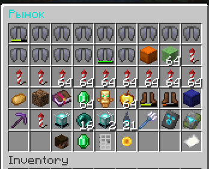

# AstraMarket

A player-driven market / auction house for your Minecraft server. Players list items straight from
their hand, browse everyone's offers in a paginated GUI, and buy with your server economy — no lag,
with config and database reload at runtime.

<p align="center">
  
</p>

## Supported version

- **Loader:** Paper (and forks)
- **Minecraft:** 1.18+

## Features

- [x] Sell the item in your hand with a single command
- [x] Paginated market GUI with two views: all items, or grouped per player
- [x] Sorting by date, material, name, price and player (ascending / descending)
- [x] Buy items using your economy (Vault, with EssentialsX fallback)
- [x] Take your own listings back at any time
- [x] Moderators can expire any listing into the owner's expired list
- [x] Automatic expiry of old listings (configurable lifetime, checked every minute)
- [x] Per-listing limits: global cap plus a per-player permission override
- [x] Min / max price guardrails
- [x] Optional broadcast when a new item is listed
- [x] Configurable sounds for open, close, click, success, fail and sold
- [x] Configurable GUI buttons (material + custom model data)
- [x] Fully translatable messages (defaults ship in Russian)
- [x] H2, SQLite, MySQL and MariaDB storage, switchable and reloadable at runtime

## Commands & permissions

All of the following aliases open the **same** market and share the same subcommands:
`/market`, `/ah`, `/auctionhouse`, `/aauc`, `/amarket`.

| Command                          | Description                                       | Permission            |
|:---------------------------------|:--------------------------------------------------|:----------------------|
| `/amarket`                       | Open the market GUI                               | —                     |
| `/amarket players`               | Open the market grouped per player                | —                     |
| `/amarket sell <price> [amount]` | List the item in your hand (amount defaults to 1) | —                     |
| `/amarketreload`                 | Reload config, translations and database          | `astra_market.reload` |

Additional permissions that gate in-GUI actions and limits:

| Permission                  | Effect                                                                                  |
|:----------------------------|:----------------------------------------------------------------------------------------|
| `astra_market.remove_slot`  | Right-click your own listing to take it back                                            |
| `astra_market.expire`       | Middle-click any listing to move it to the owner's expired list                         |
| `astra_market.sell_max.<N>` | Raise this player's maximum active listings to `N`, overriding `max_auction_per_player` |

### Using the GUI

- **Left-click** an item — buy it (the price is transferred from you to the seller).
- **Right-click** your own item — take it back into your inventory.
- **Middle-click** an item — expire it into the owner's expired list (requires `astra_market.expire`).
- **Sort** button — left/right-click to change the sort field and direction.
- **Filter** button — switch between new and expired listings.
- **Display type** button — switch between the all-items view and the per-player view.
- **Next / Previous** buttons — page through listings.

## Configuration

On first launch the plugin creates three files in its data folder. If a file cannot be parsed, the
error is logged to the console so you can see exactly what is wrong.

- `config.yml` — behavior, sounds and buttons
- `translations.yml` — all player-facing messages (translate freely)
- `database.yaml` — storage backend

### `config.yml`

```yaml
auction:
  use_compact_design: true
  max_auction_per_player: 5
  min_price: 10
  max_price: 1000000
  # Reserved: tax is not applied to purchases yet
  tax_percent: 0
  announce: true
  # Listing lifetime in milliseconds (default: 7 days). Older listings are auto-expired.
  max_time_seconds: 604800000
  # The Vault currency id you want to use
  currency_id: null
sounds:
  open: "ui.button.click"
  close: "ui.button.click"
  click: "ui.button.click"
  fail: "entity.villager.no"
  success: "block.note_block.chime"
  sold: "block.note_block.chime"
buttons:
  back:
    material: "REDSTONE_BLOCK"
    custom_model_data: 0
  previous:
    material: "ARROW"
    custom_model_data: 0
  next:
    material: "ARROW"
    custom_model_data: 0
  sort:
    material: "OBSERVER"
    custom_model_data: 0
  aauc:
    material: "COMPOSTER"
    custom_model_data: 0
  border:
    material: "BLACK_STAINED_GLASS_PANE"
    custom_model_data: 0
  players_slots:
    material: "SLIME_BLOCK"
    custom_model_data: 0
```

Key options:

| Key                       | Meaning                                                                                       |
|:--------------------------|:----------------------------------------------------------------------------------------------|
| `use_compact_design`      | Use the compact inventory layout for the market GUI                                           |
| `max_auction_per_player`  | Default cap on simultaneous listings per player (overridable via `astra_market.sell_max.<N>`) |
| `min_price` / `max_price` | Allowed price range for a new listing                                                         |
| `announce`                | Broadcast a message when a player lists a new item                                            |
| `max_time_seconds`        | Listing lifetime in **milliseconds**; older listings are auto-expired                         |
| `currency_id`             | Vault currency to use (when `null`, the default economy provider is used)                     |

### `database.yaml`

The database can be changed and reloaded at runtime with `/amarketreload`. Four backends are
supported; the default is a file-based H2 database.

```yaml
# H2 (default)
configuration:
  type: "H2"
  path: "plugins/AstraMarket/database"
  driver: "org.h2.Driver"
  arguments: [ ]
```

```yaml
# SQLite
configuration:
  type: "SQLite"
  path: "plugins/AstraMarket/database"
  driver: "org.sqlite.JDBC"
  arguments: [ ]
```

```yaml
# MySQL
configuration:
  type: "MySql"
  host: "127.0.0.1"
  port: 3306
  user: "root"
  password: "password"
  name: "astramarket"
  driver: "com.mysql.cj.jdbc.Driver"
  arguments: [ ]
```

```yaml
# MariaDB
configuration:
  type: "MariaDB"
  host: "127.0.0.1"
  port: 3306
  user: "root"
  password: "password"
  name: "astramarket"
  driver: "org.mariadb.jdbc.Driver"
  arguments: [ ]
```

The JDBC drivers are downloaded automatically at startup, so no extra installation is required.

## Integrations

| Plugin                                                   | Required                 | Used for                                              |
|:---------------------------------------------------------|:-------------------------|:------------------------------------------------------|
| [Vault](https://www.spigotmc.org/resources/vault.34315/) | Soft (needed for buying) | Taking money from the buyer and paying the seller     |
| [EssentialsX](https://essentialsx.net/)                  | Soft                     | Economy fallback when no Vault provider is registered |

Buying requires a working economy provider. If neither Vault nor EssentialsX economy is available,
purchases are rejected.

---

## 💜 Support Us

If our projects help you, consider supporting their development.

<table>
<tr>
<td align="center" width="130">
<br/>
<sub><b>Bitcoin</b></sub>
</td>
<td>

```text
bc1q9a8dr55jgfae0mhevw3vvczegjv0khfp0ngrnv
```

</td>
</tr>
<tr>
<td align="center" width="130">
<br/>
<sub><b>Ethereum</b></sub>
</td>
<td>

```text
0x0BaAeEA44Ce08c8DC139224ff57563695B30d423
```

</td>
</tr>
<tr>
<td align="center" width="130">
<br/>
<sub><b>Boosty</b></sub>
</td>
<td align="center">
<a href="https://boosty.to/empireprojekt/donate">

</a>
</td>
</tr>
</table>

---

## Links

- Author: **makeevrserg** (Makeev Roman) · <https://empireprojekt.ru>
- More plugins from [AstraInteractive](https://github.com/Astra-Interactive)


